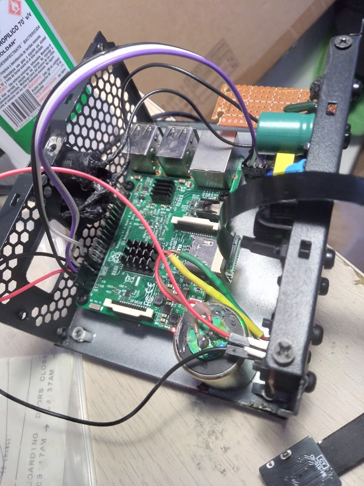
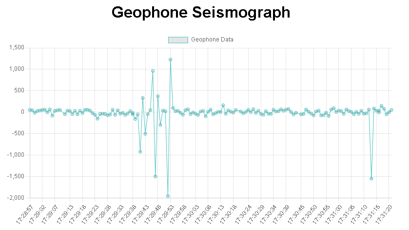

# Geophone Seismograph Project

This project creates a web-based seismograph using a Raspberry Pi with a geophone sensor. A background daemon samples the sensor at a fixed rate and runs an STA/LTA detector to flag P-wave arrivals in real time; the Flask app serves the chart and pushes alerts to the browser as they happen.

## Architecture

```
ADS1115 ADC --100Hz--> acquisition/daemon.py --STA/LTA--> SQLite --+--> Flask /data   (chart)
                              |                                     +--> Flask /events/stream (SSE alerts)
                              +-> events_queue.jsonl (events only) -^
```

The daemon runs **independently of Flask and of any browser tab** (as a systemd service), so sampling never stops just because no one has the page open. Flask only reads from the database and pushes notifications; it never talks to the ADC directly.

## Features

- Continuous 100 Hz sampling, decoupled from the web UI
- STA/LTA-based P-wave detection (standard seismology technique)
- Real-time browser alerts via Server-Sent Events when an event is detected
- Real-time chart visualization of raw geophone data
- Automatic pruning of old raw samples to keep the database small

## Requirements

- Raspberry Pi
- Geophone sensor + amplifier board (e.g. HW-484) wired to an ADS1115 ADC
- Python 3.x
- Flask, Flask-Migrate, SQLAlchemy, Adafruit-ADS1x15
- Chart.js, chartjs-adapter-date-fns

## Setup and Installation

### 1. Hardware Setup

Connect the geophone sensor (via its amplifier board) to your Raspberry Pi's ADS1115 ADC over I2C. Follow the sensor's datasheet for correct wiring and configuration.

Check this article in core-electronics: https://core-electronics.com.au/guides/geophone-raspberry-pi/

### 2. Software Setup

1. Install dependencies:
    ```bash
    pip install -r requirements.txt
    ```

2. Set up the database (if upgrading from a previous version that used a
   single `geophone_records` table, delete `data/geophone_records.db`
   first — the schema has changed):
    ```bash
    flask db init
    flask db migrate -m "Add GeophoneSample and SeismicEvent tables"
    flask db upgrade
    ```

3. Start the acquisition daemon (this is what actually talks to the ADC
   and runs the STA/LTA detector — it must be running for any data to
   appear):
    ```bash
    python -m acquisition.daemon
    ```
   For a permanent setup, install it as a systemd service instead, so it
   survives reboots and keeps acquiring data even with no browser open:
    ```bash
    sudo cp acquisition/geophone-daemon.service /etc/systemd/system/
    # edit WorkingDirectory= and User= in that file to match your setup
    sudo systemctl daemon-reload
    sudo systemctl enable --now geophone-daemon
    sudo journalctl -u geophone-daemon -f   # watch logs / detections
    ```

4. Run the web application (in a separate terminal/process from the daemon):
    ```bash
    python run.py
    ```

5. Navigate to `http://<your-raspberry-pi-ip>:5000` to view the seismograph.
   A red banner appears and the event is logged in the "Detected Events"
   list whenever the STA/LTA detector flags a P-wave arrival.

## Tuning detection sensitivity

The STA/LTA parameters live at the top of `acquisition/daemon.py`:

- `TRIGGER_RATIO` (default 4.0): higher = fewer false positives, but may
  miss small/distant earthquakes. Lower = more sensitive, but more
  false triggers from foot traffic, doors, trucks passing, etc.
- `STA_WINDOW_S` / `LTA_WINDOW_S`: the short window should roughly match
  the duration of a single P-wave cycle; the long window should
  represent "typical background noise" at your specific location.
- `MIN_EVENT_DURATION_S`: filters out single-sample electrical spikes.

There's no universally correct value — expect to watch `journalctl -u
geophone-daemon -f` for a few days and adjust based on your own noise
floor and how many false positives you're willing to tolerate.

##



