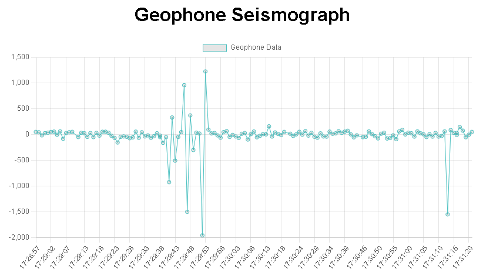

# Geophone Seismograph Project

This project creates a web-based seismograph using a Raspberry Pi with a geophone sensor. The application uses Flask to serve the data and Chart.js to visualize it in real-time.

## Features

- Real-time visualization of geophone data
- Automatic data fetching and updating
- Data persistence via server-side storage

## Requirements

- Raspberry Pi
- Geophone sensor
- Python 3.x
- Flask
- Chart.js
- chartjs-adapter-date-fns

## Setup and Installation

### 1. Hardware Setup

Connect the geophone sensor to your Raspberry Pi. Follow the sensor's datasheet for correct wiring and configuration.

Check this article in core-electronics: https://core-electronics.com.au/guides/geophone-raspberry-pi/

### 2. Software Setup

1. Install dependencies:
    ```bash
    pip install -r requirements.txt
    ```

2. Setup the Database Model:
    ```bash
    flask db init
    ```
    ```bash
    flask db migrate -m "Initial migration"
    ```
    ```bash
    flask db upgrade
    ```

3. Run the application:
    ```bash
    python run.py
    ```

4. Navigate to `http://<your-raspberry-pi-ip>:5000` to view the seismograph.

##


